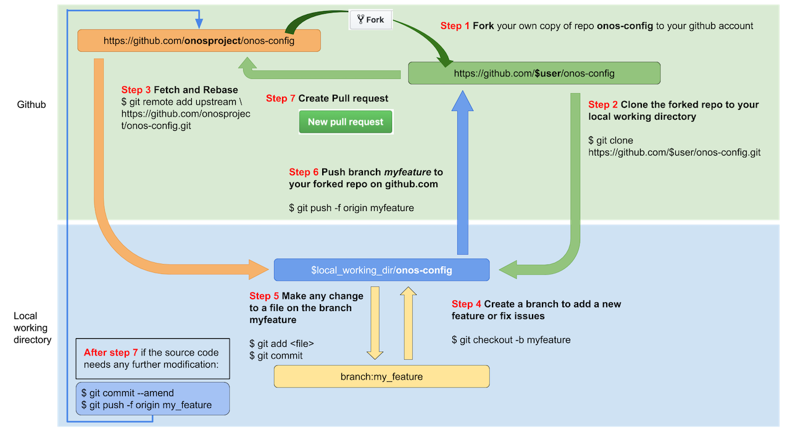
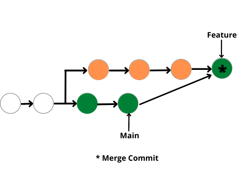
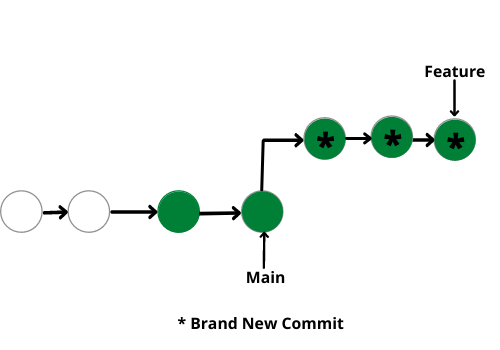

::: {.callout-note}
## Overview

This module presents some information on multi-user Git, numerical analysis (random number generation and floating point precision), packaging, reproducibility, and automation.
:::

# 7. Multi-user Git

Once you are working on more complicated projects and particularly when working with multiple people, you'll want to be able to use branches and pull requests (PRs) to manage the work.

::: {.callout-tip collapse="true"}
## Why use branches and pull requests?

- Experiment without worrying about breaking the current code.
- Test your code before finalizing changes (particularly with testing via continuous integration / GitHub Actions).
- Organize aspects of the project for clarity and collaboration.
- Manage collaboration:
   - Manage code contributions from others.
   - Discuss changes.
   - Keep track of changes.
   - Accept external contributions.
   - Resolve conflicts between different changes.
:::

Before going further, let's review our visualization of working with Git ([online version](https://docs.google.com/presentation/d/1YlM3boYLE8DwbxGNO3ZVVt3e9gEoBgD1uc9RtItUYCU), [PDF version](git_visuals.pdf))

## Demo: Branching and pull requests, merge conflicts

We'll demo the use of branching and PRs by fixing our `optimize` function.

### Branching

First, let's fix the error in our function in a new branch.

We'll first (create and) switch to the new branch:

```bash
git switch -c fix_initial_bugs
```

We'll now make the fixes and do the linting (not shown).

Push the branch with the fix to GitHub.

```bash
git add newton.py

git commit -m'Fix initial bugs:
- derivative interval too small
- stopping criterion logic incorrect
- copy-paste duplication'

git push -u origin fix_initial_bugs
```

### Pull requests

Now we'll go to GitHub and start a pull request (PR).

Since we're the ones who control the repo, we'll also review and merge in the PR.

### Merge conflicts

Next let's see a basic example of a *merge conflict*, which occurs when two commits modify (which could include deletion) the same line in a file. In this case Git requires the user to figure out what should be done.

To get an example, we need to create a conflict. I will add different documentation in the `main` and `fix_initial_bugs` branches. After pushing the `main` change, I'll try to do a PR with the `fix_initial_bugs`.

The GitHub UI does a nice job of helping you resolve merge conflicts, as we'll see.

::: {.callout-tip}
## Resolving conflicts at the command line

You can also get (and resolve) merge conflicts on the command line. Git will add some syntax to the conflicted file pointing out the conflicts that need to be resolved. Once you edit the conflicted file to fix the conflict, you can do `git add <name_of_file>` and then `git commit`.
:::

## Multivariate Newton's method

Recall that Newton's method optimizes some objective function, $f(x)$ as a function of univariate or multivariate $x$, where $f(x)$ is univariate.

The multivariate method extends the univariate, using the gradient (first derivative) vector and Hessian (second derivative) matrix.

If we are at step $t-1$, the next value is:

$$
x_{t+1}=x_{t}-H_{f}(x_{t})^{-1}\nabla f(x_{t})
$$

where $\nabla f(x_{t})$ is the gradient (first derivative with respect to each element of $x$) and $H_{f}(x_{t})$ is the Hessian matrix (second derivatives with respect to all pairs of the elements of $x$).


Here are the steps:

- determine a starting value, $x_0$.
- iterate:
  - at step $t$, the next value (the update) is given by the equation above
  - stop when $\left\Vert x_{t} - x_{t-1} \right\Vert$ is "small"

## Exercise: Branching

1. Make sure you've committed your tests and any changes made to your univariate Newton's method to your `main` branch. And make sure you push the changes to GitHub.
2. Make a branch (called `multivariate`) in which you'll implement the multivariate version of Newton's method (see details above)
3. Implement the algorithm, either in `newton.py` or in a new file if you prefer.

You may need to search online for how to calculate $H_{f}(x_{t})^{-1}\nabla f(x_{t})$.

At this point, if we think about calculating the Hessian it starts to feel more tedious to deal with the finite difference calculations, though it is a straightforward extension of what you already implemented. Feel free to look online to find a Python package that implements finite difference estimation of derivatives and use that in your code (see what Google indicates or if you use a ChatBot/LLM what they suggest).

As you are writing the code, you can continue to think about what might go wrong and include defensive programming tactics. 

## Exercise: Pull requests (PRs)

When you have your branch ready, make a pull request:

1. Make a pull request into the remote for the repository by pushing the branch to GitHub
   ```bash
   git push -u origin multivariate
   ```
   
2. Go to GitHub to the `Pull requests` tab and make the PR, making a note of what the PR is about.

Don't (yet) merge in the PR. We want someone else to review it to have additional eyes on the code.

## Exercise: Code review

Now find a partner. 

Give the partner the URL for your repository on GitHub and ask them to look at the PR.
In turn get the URL for their repository.

In reviewing the PR, make comments in the PR comment/conversation area on GitHub.

If you have time, explore these two additional options for making comments:

1. Review changes:
   - Click on the `Files changed` tab (or go to `https://github.com/<USERNAME>/newton-practice/pull/<PULL_ID>/files` for the specific "PULL_ID").
   - Click on the `Review changes` button.
2. Make comments on specific lines
   - Click on the `Files changed` tab (or go to `https://github.com/<USERNAME>/newton-practice/pull/<PULL_ID>/files` for the specific "PULL_ID").
   - Hover over a specific line in a specific file with your mouse. A blue "plus" box should appear. Click on the plus to add a comment.
   - Click on `Add single comment` or optionally experiment with `Start a review`.

::: {.callout-tip title="Code review guidelines"}

[This article](https://journals.plos.org/ploscompbiol/article?id=10.1371/journal.pcbi.1012375) gives tips on how to do good code review (and how to set up projects to facilitate good reviewing).

:::

## Exercise: Merge the PR

Once you've seen the review by your partner:

- On DataHub, make changes to the branch that was used in the pull request. Then commit and push to GitHub.
  - Alternatively, you could make the changes directly on GitHub using its editing capabilities.
- On GitHub, merge in the (now revised) pull request and close the request.
  - You may want to delete the branch. This helps avoid having a profusion of unneeded branches.
- On DataHub, run `git pull` to get the changes updated in the `main` branch of your local repository.

::: {.callout-important}
## The full cycle of "git virtue"

Congratulations. In the course of yesterday and  this morning, you've worked through the steps of a complete, albeit small, project using an extensive set of concepts, skills, and tools used in real world projects.
:::

# 8. Numerical analysis and random number generation

## Random number generation

Random numbers on a computer are actually (periodic) deterministic sequences that (hopefully) behave as if they were random.

### Random number seed

The *seed* determines where in the cycle of the periodic sequence you are.

It's critical for ensuring reproducibility when running code that uses random numbers

```{python}
import numpy as np
np.random.seed(1)
np.random.normal(size = 5)
```
```{python}
np.random.normal(size = 5)
```
```{python}
np.random.seed(1)
np.random.normal(size = 10)
```


### Random number generators


If you don't do anything, numpy will use a generator called the Mersenne Twister (that's the default in R too).

However the "default" RNG in numpy is a newer, better algorithm called PCG64. 

```{python}
## Mersenne twister
np.random.seed(1)
np.random.normal(size = 5)
```
```{python}
## Mersenne twister, selected specifically
rng = np.random.Generator(np.random.MT19937(seed = 1))
rng.normal(size = 5)
## Not clear why numbers differ from above. Seed setup might differ.
```
```{python}
## 'Default' PCG64
rng = np.random.Generator(np.random.PCG64(seed = 1))
rng.normal(size = 5)
```
```{python}
rng = np.random.default_rng(seed = 1)
rng.normal(size = 5)
```

Some cautions ([detailed by Philip Stark and Kellie Ottoboni](https://arxiv.org/pdf/1810.10985)):

- seeds with many zeros can be problematic.
- Mersenne Twister not as good as PCG64.
- Be particularly cautious to use a good RNG when doing permutation and taking random samples.


## Floating point precision

```{python}
0.3 - 0.2 == 0.1
0.3
0.2
0.1 # Hmmm...
```

### Double-precision accuracy

Numbers in most languages are stored by default as double precision floating point numbers.

- 8 bytes = 64 bits = double precision
- 4 bytes = 32 bits = single precision

(GPU libraries often use 4 bytes or even fewer, or a mix of precisions.)


```{python}
def dg(x, form = '.20f'):
    print(format(x, form))

a = 0.3
b = 0.2
dg(a)
dg(b)
dg(a-b)
dg(0.1)
```

How many digits of accuracy do we have?

Same thing regardless of the size of the number:

```{python}
12345678.1234567812345678
```
```{python}
12345678123456781234.5678
```
```{python}
dg(12345678123456781234.5678)
```

This occurs because of how the 64 bits in a double precision floating point number are allocated to give a large range of numbers in terms of magnitude and high precision in terms of digits of accuracy.


### Comparisons

Let's see what kinds of numbers we can safely compare for exact equality with `==`.

```{python}
#| eval: false
x = .5 - .2
x == 0.3
x = 1.5 - .2
x == 0.3

x = .5 - .5
x == 0
x = .5 - .2  -.3
x == 0
x = (.5 - .2) - (.51 - .21)
x == 0

np.isclose(x, 0)
```

### Calculation errors

Let's consider accuracy of subtraction.

```{python}
1.1234 - 1.0
```
```{python}
123456781234.1234 - 123456781234.0
```

This is called catastrophic cancellation.

Do you think calling it "catastrophic" is too extreme? If so, consider this.

```{python}
81.0 - 80.0
```
```{python}
12345678123456781.0 -12345678123456780.0
```


What's the derivative of $sin(x)$? Let's see what kind of accuracy we can get.

```{python}
#| eval: false
def deriv(f, x, eps=1e-8):
   return (f(x+eps) - f(x)) / eps

truth = np.cos(0.2)
print(truth)  # Well, "truth" on a computer.

deriv(np.sin, 0.2)

deriv(np.sin, 0.2, 1e-12)
deriv(np.sin, 0.2, 1e-14)
deriv(np.sin, 0.2, 1e-15)
deriv(np.sin, 0.2, 1e-16)
deriv(np.sin, 0.2, 1e-17)
```

### Linear algebra errors (optional)

The errors seen in doing calculations, such as catastrophic cancellation, cascaded through derivative estimation. That also happens when doing linear algebra operations.

Here's an example where mathematically all the eigenvalues are real-valued and positive, but not on the computer.

```{python}
import scipy as sp

xs = np.arange(100)
dists = np.abs(xs[:, np.newaxis] - xs)
# This is a p.d. matrix (mathematically).
corr_matrix = np.exp(-(dists/10)**2)
# But not numerically...
sp.linalg.eigvals(corr_matrix)[80:99]
```


### Overflow and underflow

Having a finite number of bits to represent each number means there are minimum and maximum numbers that can be expressed.

```{python}
1.38e5000
1.38e-400
```

::: {.callout-tip}
## How much do we need to worry about overflow and underflow?

Q: Roughly how many observations would it take before we underflow in calculating a likelihood?

- 10
- 100
- 1000
- 100000
- 100000000

:::

```{python}
import numpy as np
import scipy as sp

n = 10

x = np.random.normal(size=n)
np.prod(sp.stats.norm.pdf(x))

loglik = np.sum(sp.stats.norm.logpdf(x))
loglik
np.exp(loglik)
```

::: {.callout-important}
## Work with probabilities and densities on the log scale. Almost always.
:::

## Exercise: forking and pull requests for numerical issues with Newton's method

Look at your partner's code in terms of how it handles the stopping criterion or (for the 1-d case) the finite difference estimate of the gradient and Hessian.

Fork your partner's repository. In the local version of that repository on your DataHub, make a change to try to improve how the stopping criterion or finite difference estimate is handled. Then make a pull request back into your partner's repository.

Here are the detailed steps of how to do all that:

1. Go to your partner's GitHub page and fork the repository (`https://github.com/<partner_username>/newton-practice/fork`). You can name it `newton-practice-<partner_name>` or something else. 
2. On DataHub, clone the forked repository: `git clone https://github.com/<your_username>/newton-practice-<partner_name>`.
3. On DataHub, enter the directory of the cloned repository: `cd newton-practice-<partner_name>`.
4. Make a branch, make changes, add, and commit.
5. Give DataHub access to the new repository via [Step 3 of the steps for accessing GitHub repository from DataHub](https://berkeley-scf.github.io/compute-skills-2025/prep.html#give-access-to-the-specific-github-repository-you-are-working-with).
6. Push the commit to your GitHub: `git push -u origin newton-practice-<partner_name>`.
7. Go to `https://github.com/<your_username>/newton-practice-<partner_name>` and open a pull request ("Compare and pull request") with the new branch. The request will automatically be done in the GitHub account of your partner.

Then review the pull request your partner made to YOUR repository. Iterate with your partner until you are happy to merge the pull request into your repository. Remember to then run `git pull` to get the changes in the local copy of the repository.

## Forking and contributing to projects 'upstream' (advanced)

What you just did in the exercise is very similar to how open source projects work with external developers who want to contribute to the project. The project on GitHub is referred to as "upstream".

Here's how it works, in the form of a diagram. 

{fig-alit="visualization of working with upstream repositories"}

Note that Step 3 allows you to ensure that your local copy of the repository is up-to-date with the remote copy upstream. If there are no changes to the upstream branch you are contributing to between when you fork and when you create the pull request, you wouldn't need Step 3. But if you were to continue contributing in the future, you'd want to run Step 3 to update the main branch locally before creating your own new branch for your next contribution.

Also note that after running `git remote add upstream ...`, you can run `git remote -v` to see that your repository's configuration shows "upstream" as the label for the remote repository. This will be in addition to seeing "origin" as the label for your fork of that repository.

## Merging vs. rebasing (advanced)

You'll probably run across the idea of rebasing at some point. In fact it's mentioned just above in relation to updating your local repository from upstream.

A rebase moves a series of commits to a new base commit, as if you had just done the work of those commits starting from that base commit instead of starting from the commit you actually started from (usually further back in the history of commits). It can be a good thing to do in some cases as it produces a simpler history of commits than a regular merge (in which the commit that does the merge combines the changes from both branches).

A merge looks like this:

{fig-alit="visualization of merge commit"}

while a rebase looks like this, with the three orange commits above moved such that it looks like they were just done directly on the tip of the Main branch. In fact the three orange commits are removed and the changes are redone as the three new green * commits 

{fig-alt="visualization of merge commit"}

::: {.callout-important title="Only rebase if know what you are doing"}
Rebasing involves changing the commit history by deleting the original commits and replaying them onto the new base commit. That will mess things up for others if other users have access to those commits.

Therefore only rebase if those commits are only in your local repository and not pushed to a remote.
:::


# 9. Packaging and Conda environments

## Packages

What's a package? In general it is software that is provided as a bundle that can be downloaded and made available on your computer.
Some packages (e.g., R, Python themselves) are stand-alone packages. Others (such as R packages and Python packages) are add-on functionality that works with and extends the functionality of the stand-alone software.

What do we need to have a Python package?

### A basic Python package

A Python package is a directory containing one or more modules and with a file
named `__init__.py` that is called when a package is imported and
serves to initialize the package.

Let's create a basic package.

```bash
mkdir mypkg

cat << EOF > mypkg/__init__.py
## Make objects from mymod.py available as `mypkg.object_name`.
from mypkg.mymod import *

print("Welcome to my package.")
EOF

cat << EOF > mypkg/mymod.py
x = 7

def myfun(val):
    print("The arg is: ", str(val), ".", sep = '')
EOF
```

Note that if there were other modules (i.e., Python code files), we could have imported from those as well.

Now we can use the objects from the package without having to know
that it was in a particular module (because of how `__init__.py` was set up).

```{python}
#| eval: false
import mypkg
mypkg.x
mypkg.myfun(7)
```

Note that one can set `__all__` in an `__init__.py` to define what is imported,
which makes clear what is publicly available and hides what is considered
internal.

### A minimal "real" package


Fernando has a [this toy example package](https://github.com/fperez/mytoy).

Let's clone the repository and see if we can install it.

```bash
git clone https://github.com/fperez/mytoy
cd mytoy
pip install --user .
cd
ls .local/lib/python3.11/site-packages
```

```{python}
#| eval: false
import mytoy

mytoy.toy(7)
```

Let's look in the top directory of the repository. There we see various files related to building and installing the package, namely, `pyproj.toml`, `setup.py`, `setup.cfg`, etc.

In fact, one can install the package with only
either `setup.py` or `pyproj.toml`, but the other files listed here are recommended:

- `pyproj.toml` (or `pyproject.toml`): this is a configuration file used by packaging tools. In the `mytoy` example it specifies to use `setuptools` to build and install the package.
- `setup.py`: this is run when the package is built and installed when using `setuptools`. In the example, it simply runs `setuptools.setup()`. With recent versions of
`setuptools`, you don't actually need this so long as you have the `pyproj.toml` file.
- `setup.cfg`: provides metadata about the package when using `setuptools`.
- `environment.yml`: provides information about the full environment in which your package should be used (including examples, documentation, etc.). For projects using `setuptools`, a minimal list of dependencies needed for installation and use of the package can instead be included in the `install_requires` option of `setup.cfg`.
- `LICENSE`: specifies the license for your package giving the terms under which others can use it.

The `postBuild` file is  a completely optional file only needed if you want to use the package with a MyBinder environment.

At the [numpy GitHub repository](https://github.com/numpy/numpy), by looking in  `pyproject.toml`, you can see that `numpy` is build and installed using a system called *Meson*, while at the [Jupyter GitHub repository](https://github.com/jupyter/jupyter) you can see that the `jupyter` package is built and installed using `setuptools`.

*Building* a package usually refers to compiling source code (but for a Python package that just has Python code, nothing needs to be compiled). *Installing* a package means putting the built package into a location on your computer where packages are installed.


It would take more work to make the package available in a repository such as PyPI or via Conda.

### Tests in a package

To set up tests, see the structure of the `tests` directory of `mytoy`. You'll one or more test files with "test" in their filename(s). Having an `__init__.py` (such as the empty one in `mytoy/tests`) is not required (as far as I know).

You can then run `pytest` (in which case `pytest` will try to find all tests
in the current directory and its subdirectories) or `pytest mytoy` to only run the tests in the `mytoy` subdirectory.

## Exercise: Make your own package

Make a package out of your Newton method code, following the structure of `mytoy`. Include your tests as part of the package.

See if you can install your package, run the tests, and use the package, following the `README.md` of `mytoy`.

## Installing packages


If a package is on PyPI or available through Conda but not on your system, you can install it
easily (usually). You don't need root permission on a machine to install
a package, though you may need to use `pip install --user` (which installs into `~/.local`) or set up a new Conda environment.

Packages often depend on other packages. In general, if one package depends on another,
pip or conda will generally install the dependency automatically.

One advantage of Conda is that it can also install non-Python packages on which a Python
package depends, whereas with pip you sometimes need to install a system package to
satisfy a dependency.

::: {.callout-tip}
## Dependency resolution and Conda/Mamba

It's not uncommon to run into a case where conda has trouble installing a package
because of version inconsistencies amongst the dependencies.

As of version 23.10.0 (fall 2023) of Conda, it defaults to using a faster and better "solver" to resolve
dependencies, called `mamba`.

With older versions of conda , you can also use the `libmamba` dependency "resolver" by running `conda config --set solver libmamba`, which adds `solver: libmamba` to your `.condarc` file.

:::

### Reproducibility and package management

For reproducibility, it's important to know the versions of the packages you use (and the version of Python).
`pip` and `conda` make it easy to do this. You can create a *requirements* file that captures the packages you are currently using (and, critically, their versions) and then install exactly that set of packages (and versions) based on that requirements file. 

```bash
## Reproducing using pip.
pip freeze > requirements.txt
pip install -r requirements.txt

## Reproducing a Conda environment.
conda env export --no-builds > environment.yml
conda env create -f environment.yml
```


::: {.callout-warning}
## Portable Conda recipes
If you just use `conda env export`, installing on a different operating system will generally fail because the requirements file includes build-specific versioning (using hashtags) that only works on the specific operating system. The `--no-builds` flag omits that information and just includes version numbers.
:::

::: {.callout-tip}
## Conda is for more than just Python
Conda is a general package manager. You can use it to manage Python packages but lots of other software as well, including R and Julia.
:::


#### Fully isolating your Conda environment (optional)

Conda environments provide an additional layer of modularity/reproducibility, allowing you to set up a fully reproducible environment for your computation. Here (by explicitly giving `python=3.11`) the Python 3.11 executable and all packages you install in the environment are fully independent  of whatever Python executables are installed on the system. (That said, there are [some caveats](https://statistics.berkeley.edu/computing/software/install#conda-isolate) that can make it a bit of headache to ensure full isolation.)

```bash
type python

conda create -n my_iso_env python=3.11
source activate my_iso_env

type python
conda install numpy

## (Optionally) saving the recipe:
conda env export > my_iso_env.yml
```


::: {.callout-warning}
## Activating an environment
If you use `conda activate` rather than `source activate`, Conda will prompt you to run `conda init`, which will make changes to your `~/.bashrc` that, for one, activate the Conda base environment automatically when a shell is started. This may be fine, but it's helpful to be aware.
:::

### Package locations

Packages in Python (and in R, Julia, etc.) may be installed in various places
on the filesystem, and it sometimes it is helpful (e.g., if you end up with multiple
versions of a package installed on your system) to be able to figure out 
where on the filesystem the package is being loaded from. 

- `pkgname.__file__` will show where the imported package is installed.
- `pkname.__version__` will show the version of the package (as will `pip list` or `conda list`, for all packages).
- `sys.path` shows where Python looks for packages on your system.
  - packages installed via `pip` will generally be in `~/.local/lib/python3.X/site-packages`.

Let's check that `numpy` got installed into the `my_iso_env` environment where we expect it to be.

```{python}
#| eval: false
import numpy
numpy.__file__
```

### Source vs. binary packages

The difference between a *source* package and a *binary* package is that

- a *source* package has the raw Python (and C/C++ and Fortran, in some cases) code
as text files
- a *binary* package has all the non-Python code in a binary/non-text format, with the  C/C++ and Fortran code already having been compiled.

If you install a package from source, C/C++/Fortran code will be compiled on your system
(if the package has such code).
That should mean the compiled code will work on your system, but requires you to have a
compiler available and things properly configured. A binary package doesn't need to be
compiled on your system, but in some cases (e.g., if you got the wrong binary version) the code may not run on your system because
it was compiled in such a way that is not compatible with your system.

Python *wheels* are a binary package format for Python packages. Wheels for some packages will vary by platform
(i.e., operating system) so that the package will install correctly on the system where it is being installed.


# 10. Containers, GitHub Actions and Continuous Integration

Having reproducible environments (e.g., Conda environments or Docker containers) provides the ability to run (and automate) various actions to run on remote/cloud computational resources and know that they (should) work.

::: {callout-tip}
## Docker containers
Docker containers share some similarities with Conda environments except that you provide a full specification for the Linux operating system you want to use and software you want installed.
:::

You need to provide the recipe for the environment or container. The automation system can then set up the environment as a virtual environment/container on the remote machine and run the action/code you request. This could simply be giving you a terminal or starting a Jupyter notebook in the environment and giving you access via your browser.

In this section, we'll show some examples of automation with reproducible environments.

There are a lot more out there. In fact, DataHub is based on Docker containers (and a container management service called Kubernetes). Let's see what operating system is being run in the container that your DataHub server is using.

```
$ cat /etc/issue
Ubuntu 22.04.4 LTS \n \l
```

This is all quite powerful, and the use of reproducible environments generally helps with debugging because you can also set up the environment on your own machine. That said, running code remotely or in the cloud can also be hard to debug at times.

## Example 1: Binder

One example is using Binder to open a Jupyter notebook in an executable environment.

Based on a configuration (various options are possible for how to specify the configuration), Binder will create a Docker container with the needed software installed.

The most common configuration format is to provide a Conda environment file. Binder will then create a Conda environment inside the Docker (Linux) container. The Conda environment will contain the packages specified in the environment file. 

Let's set up a Binder environment "Geospatial analytics in Python with Geopandas" that can access the [notebooks and materials provided in the repository](https://github.com/jorisvandenbossche/geopandas-tutorial) in a [computational environment](https://github.com/jorisvandenbossche/geopandas-tutorial/blob/main/environment.yml) designed to use the notebooks reliably and reproducibly. 

In some cases an *image* for the container will already be available, and all that needs to happen is to start a virtual machine using that image as the computational environment. In other cases (e.g., with a configuration you've just created), the Docker container and Conda environment need to be set up.

If we're familiar with what happens when Docker containers and Conda environments are set up, we can see in the Binder logs that a Docker container is set up (using Ubuntu Linux) and one of the steps of doing that is to create a Conda environment within the container.

Let's see the steps that are run if we use the `mytoy` repository to start a Binder environment at `ovh.mybinder.org`, specifying `fperez/mytoy` as the repository. (Note that in a number of cases, the startup has failed, probably because `mybinder` has very limited resources for providing cloud compute resources. We are using `ovh.mybinder.org` rather than `mybinder.org` in hopes that is more likely to succeed.


## Example 2: GitHub Actions for automated testing

A second example is using GitHub Actions (GHA) to automate activities such as testing. To set up a GitHub Actions workflow, one

- specifies when the workflow will run (e.g., when a push or pull request is made, or only manually)
- provides instructions for how to set up the environment for the workflow
- provides the operations that the workflow should run.

A good example is running tests whenever you make a commit to a repository containing software.

With GHA, you specify the operating system and then run the steps you specify in `.github/workflows/some_action.yml`. Some steps will  customize the environment as the initial steps and then additional step(s) will run shell or other code to run your workflow. You use pre-specified operations (called *actions*) to do common things (such as checking out a GitHub repository and installing commonly used software). 

When triggered, GitHub will run the steps in a virtual machine, which is called the *runner*.

### Joint demo/exercise

We'll walk through the steps of setting up automated testing for the `mytoy` example package. Why do this? It's common to have testing pass locally on your own machine, but fail for various reasons when done elsewhere. 

The workflow is specified using a YAML file placed in the `.github/workflows` directory of the repository.

Here's an example YAML file for testing the `mytoy` package:

```
on:
  push:
    branches:
    - main

jobs:
  CI:
    runs-on: ubuntu-latest
    steps:
    - uses: actions/checkout@v4

    # Install dependencies
    - name: Set up Python 
      uses: actions/setup-python@v5
      with:
        python-version: 3.12

    - name: Install mytoy
      run: |
        # There is a small bug here.
        cd mytoy
        pip install --user .

    - name: Run tests
      run: |
        # Another small bug here.
        cd mytoy
        pytest
```

We'll first run this with the current tests for `mytoy`, which should pass when run via GitHub Actions.
We can take a look at [the output](https://github.com/fperez/mytoy/actions).

Next, let's introduce a failing test to see what the output looks like and get a sense for how to debug it.


## Example 3: GitHub Actions for publishing webpages

We can use GitHub Actions with GitHub pages to easily publish websites, where we make changes to the repository and the workflow causes the website to be updated.

Here's the [GitHub Actions workflow (a YAML file)](https://github.com/UCB-stat-159-s23/site/blob/main/.github/workflows/book.yml) that publishes the website for the spring 2023 version of Statistics 159/259. Any commits made in the `main` branch cause the website to be updated.

### Configuring GitHub Pages

To set up GitHub Pages for a repository, go to `https://github.com/github_org/repository/settings/pages` and select `Source -> Deploy from a branch` and then choose `gh-pages` as the branch (first creating the `gh-pages` branch if necessary). The website should appear at `github_org.github.io/repository`.

### Quarto-based websites

In fact the website for this workshop was done using Quarto, which uses GitHub Pages and GitHub Actions behind the scenes.

Chris runs `quarto publish gh-pages` to update the site. Quarto will (on the local machine) render the html (convert the Markdown to html) and then behind the scenes Quarto uses [GitHub Actions](https://github.com/berkeley-scf/compute-skills-2025/actions) and [GitHub Pages (via the `gh-pages branch)](https://github.com/berkeley-scf/compute-skills-2025/tree/gh-pages) to publish the website.

# Feedback survey

[UNDER CONSTRUCTION]

Please fill out this [brief survey](https://docs.google.com/forms/d/e/XYZ).