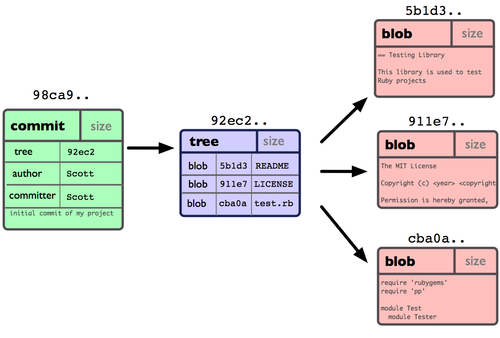
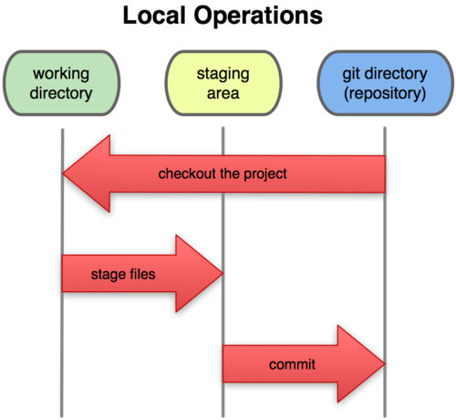
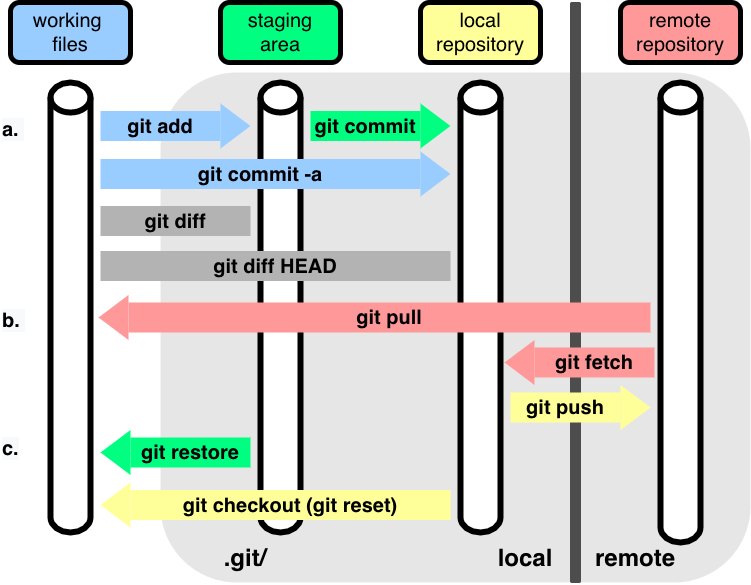

::: {.callout-note}
## Overview

This module presents the core content of the workshop on version control (using Git), code style, documentation, and testing.
:::



# 1. Our running example: Newton's method for optimization

## Newton's method background

We'll use a running example, Newton's method for optimization, during this workshop. It's simple enough to be straightforward to code but can involve various modifications, extensions, etc. to be a rich enough example that we can use it to demonstrate various topics and tools.

Recall that Newton's method works as follows to optimize some objective function, $f(x)$, as a function of univariate or multivariate $x$, where $f(x)$ is univariate. 

Newton's method is iterative. If we are at step $t-1$, the next value (when minimizing a function of univariate $x$) is:

$$
x_t = x_{t-1} - f^{\prime}(x_{t-1}) / f^{\prime\prime}(x_{t-1})
$$

Here are the steps:

- determine a starting value, $x_0$
- iterate:
  - at step $t$, the next value (the update) is given by the equation above
  - stop when $\left\Vert x_{t} - x_{t-1} \right\Vert$ is "small"

You can derive it by finding the root (aka zero) of the gradient function using a Taylor series approximation to the gradient.

## Exercise: Implement univariate Newton's method as a Python function


Here's what you'll need your code to do:

- accept a starting value, $x_0$, and the function, $f(\cdot)$, to optimize
- implement the iterative algorithm
- implement the stopping criterion (feel free to keep this simple)
- calculate the first and second derivatives using a basic finite difference approach to estimating the derivative based on the definition of a derivative as a limit
    - note that the second derivative can be seen as calling the first derivative twice...
- consider what to return as the output (feel free to keep it simple)
- don't worry much for now about making your code robust or dealing with tricky situations


   
::: {.callout-warning}
Don't make your finite difference ("epsilon") too small or you'll actually get inaccurate estimates. (We'll discuss why when we talk a bit about [numerical issues in computing](additional-topics.html#calculation-errors) later.) 

Before trying to run the full Newton method, make sure your derivative calculations work using a couple examples.
:::

::: {.callout-note}
For now, please do not use any Python packages that provide finite difference-based derivatives. (We'll do that later, and it's helpful to have more of our own code available for the work we'll do today.)

:::

::: {.callout-tip}
You're welcome to develop your code in a Jupyter Notebook, in the DataHub editor, in a separate editor on your laptop, or in VS Code on the DataHub (or your laptop).
:::

Once you've written your Python functions, put your code into a simple text file, called `newton.py`. In doing so you've created a Python *module*.

::: {.callout-warning}
Don't use a Jupyter notebook (.ipynb) file at this stage, as a notebook file won't work as a *module* and is not handled in git in the same nice manner as simple text files.
:::


Once you have your module, you can use it like this:

```{python}
#| eval: false
import newton
import numpy as np
newton.optimize(start, fun)   ## Assuming your function is called `optimize`.
newton.optimize(2.5, np.cos)  ## Minimizing cos(x) from close-ish to one minimum.
```

A *module* is a collection of related code in a file with the extension `.py`.
The code can include functions, classes, and variables, as well as
runnable code. To access the objects in the module, you need to import the module.


# 2. Introduction to Git and GitHub

## Exercise: Creating a Git repository (on GitHub)

Go to `github.com/<your_username>` and click on the `Repositories` tag. Then click on the `New` button.

- In the form, give the repository the name `newton-practice` (so others who are working with you can find it easily)
- Provide a short description
- Click on "Add a README file".
- Leave the repository as "Public" so that others can interact with your repository when we practice later.
- Scroll down to select `Python` under `Add .gitignore`.
- Select a license (the BSD 3 Clause license is a good "permissive" one).

::: {.callout-note}
## Creating repositories on your laptop first
It's also possible to [create the repository from the terminal on your machine](https://docs.github.com/en/migrations/importing-source-code/using-the-command-line-to-import-source-code/adding-locally-hosted-code-to-github#initializing-a-git-repository) and then link it to your GitHub account, but that's a couple extra steps we won't go into here at the moment.

:::

## Exercise: Accessing  GitHub repositories from DataHub

Authenticating with GitHub can be a bit tricky, particularly when using DataHub (i.e., JupyterHub).

Please follow [these instructions](../prep.qmd#accessing-github-repositories-from-datahub).

## Basic use of a repository

In the terminal, let's make a small change to the README, register the change with Git (this is called a *commit*), and push the changes upstream to GitHub (which has the *remote* copy of the repository).

#### Step 1. Clone the repository

First make a local copy of the repository from the remote copy on GitHub. It's best do this **outside** of the `compute-skills-2025` directory; otherwise you'll have a repository nested within a repository. 

```bash
## First `cd` to your home directory to avoid cloning a repo within a repo.
cd

git clone https://github.com/<your_username>/newton-practice
```

Now if we run this:

```bash
cd newton-practice
ls -l .git
cat .git/config
```

we should see a bunch of output (truncated here) indicating that `newton-practice` is a Git repository, and that in this case the local repository is linked to a *remote* repository (the repository we created on GitHub):

```bash
total 40
-rw-r--r-- 1 jovyan jovyan  264 Aug  2 15:04 config
-rw-r--r-- 1 jovyan jovyan   73 Aug  2 15:04 description
-rw-r--r-- 1 jovyan jovyan   21 Aug  2 15:04 HEAD
-rw-r--r--   1 paciorek scfstaff   16 Jul 24 14:48 COMMIT_EDITMSG
-rw-r--r--   1 paciorek scfstaff  656 Jul 23 18:20 config
<snip>

<snip>
[remote "origin"]
        url = https://github.com/paciorek/newton-practice
        fetch = +refs/heads/*:refs/remotes/origin/*
<snip>
```

(One can also see the info about the remote repository with `git remote -v`.)

#### Step 2. Add files

Next move (or copy) your Python module into the repository directory. For the demo, I'll use a version of the Newton code that I wrote that has some bugs in it (for later debugging). The file is not in the repository.

```bash
cd ~/newton-practice
cp ../compute-skills-2025/units/newton-buggy.py newton.py

## Tell git to track the file (put it in the staging area).
git add newton.py
```

The key thing is to make sure that you copy the code file into the directory of the new repository.

You can do this with `cp` in the shell as I did above.

If you're learning to use the shell, it's best to practice doing the copying in the shell, but if you really need to, you may be able to drag and move it within the DataHub file manager window pane.

Of if you have it on your laptop in a local file you edited there (instead of within DataHub), navigate to the directory of the new repository in the DataHub file manager window pane and click on the "Upload Files" button. 

#### Step 3. Edit file(s)

Edit the README file to indicate that the repository has a basic implementation
of Newton's method.

::: {.callout-tip title="Editing files"}
Here are some options for opening an Editor to edit your code/markdown/text files.

 - In DataHub, you can double-click on the file in the file manager to open an Editor window.
 - If you go to your repository on GitHub, and click into a file, you can either:
   - Click on the Pencil/Edit icon to edit the file, or
   - Press "." (the period key), and GitHub will put you into a VS Code-based editor window.
- From the terminal in the DataHub, you can start an editor such as vim or emacs or nano by typing the name of the editor and (optionally) the name of the file you want to edit, e.g., `emacs README.md`).
- You can start VS Code from within DataHub via `File -> New Launcher` and then selecting the VS Code icon. 
- You can download and upload files to your laptop. This might be more comfortable for you for large edits, but it can be inconvenient for minor changes.

:::

```bash
git status
## Tell git to keep track of the changes to the file.
git add README.md
git status
```

```bash
## Register the changes with Git.
git commit -m"Add basic implementation of Newton's method."
git status
## Synchronize the changes with the remote.
git push
```

::: {.callout-note}
We could have cloned the (public) repository without the `gh_scoped_creds` credentials stuff earlier, but if we tried to push to it, we would have been faced with GitHub asking for our password, which would have required us to create a GitHub authentication token that we would paste in.
:::

::: {.callout-note}
Instead of having to `add` files that already part of the repository (such as `README.md`) we could do:
```bash
git commit -a -m"Update README."
```
We do need to explicitly add any **new** files (e.g., `newton.py`) that are not yet registered with git via `git add`.

Caution: relying heavily on `-a` can result in commits that combine a bunch of unrelated changes (and possibly changes you didn't want to commit). Omitting `-a` and using `git add` for each changed file gives you more control and is safer.
:::

::: {.callout-note}
You can also edit and add files directly to your GitHub repository in a browser window. This is a good backup if you run into problems making commits from DataHub or your laptop.
:::


### Writing good commit messages

Some tips:

- Concisely describe what changed (and for more complicated situations, why), not how.
- Two options (depending on whether the commit makes one or more changes):
  1. Keep it short (one line, <72 characters)
  2. Have a subject line separated from the body by a blank line.
      - Keep subject to 50 characters and each body line to 72 characters.
      - Best to edit message in an editor: omit the `-m` flag to `git commit`.
- If you're working on a project with GitHub issues, reference the issue at the bottom.
- Start each item in the message with a verb (present tense) and provide a complete sentence.

::: {.callout-tip title="Avoiding complicated commit messages"}
If you find your commit message is covering multiple topics, it probably means you should
have made multiple ("atomic") commits.
:::

## Exercise: Put your code in your repository

Following the steps above, add your new code to your repository. Then commit it, providing a meaningful commit message.

You could push it to GitHub if you want, but that will be part of the exercise at the end of Section 3, so we'll troubleshoot any problems with pushing to GitHub then.


# 3. Understanding Git

::: {.callout-note}
## More than the syntax

So far we've just introduced Git by its mechanics/syntax. This is ok (albeit not ideal) for basic one-person operation, but to really use Git effectively you need to understand conceptually how it works.

More generally if you understand things conceptually, then looking up the syntax of a command or the mechanics of how to do something will be straightforward.

:::

We'll start with some visuals and then go back to some Git terminology and to the structure of a repository.

## Git visuals: Understanding Git concepts

Fernando Perez's Statistics 159/259 materials have a nice visualization ([online version](https://docs.google.com/presentation/d/1YlM3boYLE8DwbxGNO3ZVVt3e9gEoBgD1uc9RtItUYCU), [PDF version](git_visuals.pdf)) of a basic Git workflow that we'll walk through.

Note that we haven't actually seen in practice some of what is shown in the visual: tags, branches, and merging, but we'll be using those ideas later.

[Fernando's lecture materials from Statistics 159/259](https://stat159.berkeley.edu/fall-2025/lectures/intro-git/git-visuals) illustrate that the steps shown in the visualization correspond exactly to what happens when running the Git commands from the command line.


## Key components and terminology

### Commits

A *commit* is a snapshot of our work at a point in time. So far in our own repository, we've been working with a linear sequence of snapshots, but the visualization showed that we can actually have a directed acyclic graph (DAG) of snapshots once we have *branches*.

Each commit has:

 - a hash identifier - a unique identifier produced by hashing the changes introduced in the commit and also the parent commit,
 - hashes of the files in the repository in their current state, and
 - the changes (based on the `diff` tool) relative to the parent commit.



We identify each node (commit) with a hash, a fingerprint of the content of each commit and its parent. It is important the fact that the hash includes information of the parent node, since this allow us to keep the check the structural consistency of the DAG.

We can illustrate what Git is doing easily in Python.

Let’s create a first hash:

```{python}
from hashlib import sha1

# Our first commit
data1 = b'This is the start of my paper.'
meta1 = b'date: 1/1/17'
hash1 = sha1(data1 + meta1).hexdigest( )
print('Hash:', hash1)
```

Every small change we make on the previous text with result in a full change of the associated hash code. Notice also how in the next hash we have included the information of the parent node.

```{python}
data2 = b'Some more text in my paper...'
meta2 = b'date: 1/2/1'
# Note we add the parent hash here!
hash2 = sha1(data2 + meta2 + hash1.encode()).hexdigest()
print('Hash:', hash2)
```


### A repository

A *repository* is the set of files for a project with their history. It's a collection of commits in the form of an directed acyclic graph.

")

Some other terms:

- *HEAD*: a pointer to the current commit
- *tag*: a label for a commit
- *branch*: a commit - often indicating a commit that has "branched" off of some main workflow or some linear sequence of commits


### Staging area / index

The index (staging area) keeps track of changes (made to tracked files) that are added, but that are not yet committed.

Here's a high-level overview of how the staging area relates to the other pieces of what we've been doing.



And here's a more-detailed visualization of how various Git commands relate to your current directory, the staging area and the repository.




::: {.callout-tip}
## Rolling back changes (optional)

Once we have a conceptual understanding, then the commands used to undo or modify changes we've made are easier to understand, though often one has to look up the particular specific commands.

::: {.panel-tabset}

## Uncommitted changes

If I make some changes to a file that I decide are a mistake, before `git add` (i.e., before registering/staging the changes with `git`), I can always still edit the file to undo the mistakes.

But I can also go back to the version stored by Git.

```bash
# Current, recommended syntax:
git restore file.txt

# Alternative (older) syntax:
# git checkout -- file.txt  
```

## Staged, uncommitted changes

If we've added (staged) files via `git add` but have not yet committed them,
the files are in the index (staging area). We can get those changes out
of the staging area like this:

```bash
git status

# Current, recommended syntax:
git restore --staged file.txt

# Alternative (older) syntax:
# git reset HEAD file.txt  # This is older syntax.

git status
```

Note that the changes still exist in `file.txt` but they're no longer registered/staged with Git.

## Committed changes

Suppose you need to add or modify to your commit. This illustrates a few things you might do to update your commit.

```bash
git commit -m 'Some commit'

## 1. Perhaps you forgot to include a new file.
git add forgotten_file.txt

## 2. Perhaps you forgot to edit an existing file.
# Edit file.txt.
git add file.txt

## 3. Perhaps you need to get a version of a file from before.
# Get version of file from previous commit.
git checkout <commit_hash> file.txt

git commit --amend
```

Alternatively suppose you want to undo a commit:

```bash
## To go back to the previous commit, but leave the changes in the working directory.
git reset HEAD~1
## To go back to a specific commit.
git reset <commit_hash>
## To go back to a previous commit and remove any changes in the working directory.
git reset --hard <commit_hash>
```

## Pushed changes

```bash
git revert <commit_hash>
git push
```

Note that this creates a new commit that undoes the changes you don't want. So the undoing shows up in the history.
This is the safest option.

If you're *sure* no one else has pulled your changes from the remote:

```bash
git reset <commit_hash>
# Make changes
git commit -a -m'Rework the mistake.'
git push -f origin <branch_name>
```

This will remove the previous commit at the remote (GitHub in our case). 

:::

:::


## Exercise: code review (with a partner)

#### Step 0: Push your changes to GitHub

This will make them easily available to your partner and mimics the process we want/need to use anyway when interacting with remote collaborators or working asynchronously. Do your collaboration on GitHub, which is designed to help with collaboration, and not via email/text/etc.

```bash
git push
```

#### Step 1: Make suggestions

Go to your partner's repository at `https://github.com/<user_name>/newton-practice`.

1. Look over their code.
2. Make some comments/suggestions in a new GitHub issue (go to the `Issues` button and click on `New issue`).

#### Step 2: Respond to suggestions

In response to your partner's comments, make change(s) (possibly only small changes, but at least some change to give you practice) to your `newton.py` code.

You can do this in DataHub (or locally on your laptop if that's what you're doing) and make a commit as we did in the previous exercise.

Or you can do the editing in your GitHub browser window by clicking on the file and choosing the pencil icon (far right) to edit it. When you save it, a commit will be made. Make sure to provide a commit message (noting the GitHub issue is a good idea). You can also create new files via the `+` button in the top of the left sidebar. If you make changes directly on GitHub, you'll also want to run `git pull` to pull down the changes to your local repository on DataHub.

Finally, close the GitHub issue that your partner opened, leaving a brief note that you addressed the comments/suggestions.

# 4. Code style and documentation

Having a (reasonably) consistent and clean style, plus documentation, is important for being able to
read and maintain your code.

::: {.callout-tip collapse="true"}
## Q: Who is the person most likely to use your code again?

A: You, but at some point in the future by which you will have forgotten what the code does and why.

I can't tell you how many times I've looked back at my
own code and been amazed at how little I remember and frustrated with the former self who wrote it.
:::

A go-to reference on Python code style is the [PEP8 style guide](https://peps.python.org/pep-0008). That said, it's extensive, quite detailed, and hard to absorb quickly.

Here are a few key suggestions:

- Indentation:
    - Python is strict about indentation of course.
    - Use 4 spaces per indentation level (avoid tabs if possible).
- Whitespace: use it in a variety of places. Some places where it is good to have it
    are
    - around operators (assignment and arithmetic), e.g., `x = x * 3`;
    - between function arguments, e.g., `myfun(x, 3, data)`;
    - between list/tuple elements, e.g., `x = [3, 5, 7]`; and
    - between matrix/array indices, e.g., `x[3, :4]`.
- Use blank lines to separate blocks of code with comments to say what
    the block does.
- Use whitespaces or parentheses for clarity even if not needed for order of
    operations. For example, `a/y*x` will work but is not easy to read
    and you can easily induce a bug if you forget the order of ops. Instead,
    use `a/y * x` or `(a/y) * x`.
- Avoid code lines longer than 79 characters and comment/docstring lines
    longer than 72 characters.
- Comments:
    - Add comments to explain *why*, not *how*.
    - Don't restate the obvious; avoid things like `x = x + 1  # Increment x.`.
    - Some key things to document:
      - summarizing a block of code,
      - explaining a complicated piece of code or particular construction, and
      - explaining non-obvious values or steps, such as `x = x + 1 # Compensate for image border.`
    - Comments should generally be complete sentences.
- You can use parentheses to group operations such that they can be split up into lines
  and easily commented, e.g.,
  ```{python}
  #| eval: false
  newdf = (
          pd.read_csv('file.csv')                   # 1988 census data.
          .rename(columns = {'STATE': 'us_state'})  # Adjust column names.
          .dropna()                                 # Remove rows with missing values.
          )
  ```
- Being consistent about the naming style for objects and functions is hard, but try to be consistent. PEP8 suggests:
    - Class names should be UpperCamelCase.
    - Function, method, and variable names should be snake_case, e.g., `number_of_its` or `n_its`.
    - Non-public methods and variables should have a leading underscore.
- Try to have the names be informative without being overly long.
- Don't overwrite names of objects/functions that already exist in the language. E.g., don't use `len` in Python. That said, the namespace system helps with the unavoidable cases where there are name conflicts.
- Use active names for functions (e.g., `calc_loglik`, `calc_log_lik`
    rather than `loglik` or `loglik_calc`). Functions are like to verbs in human language.
- Learn from others' code.

## Linting

Linting is the process of applying a tool to your code to enforce style.

We'll demo using `ruff` to some example code. You might also consider `black`.

We'll practice with `ruff` with a small module we'll use next also for debugging.

- First, we check for and fix syntax errors.
  ```bash
  ruff check newton.py
  ```
- Then we ask `ruff` to reformat to conform to standard style.
  ```bash
  cp newton.py newton-save.py   # So we can see what `ruff` did.
  ruff format newton.py
  ```

Let's see what changed:

```bash
diff newton-save.py newton.py
```

## Exercise: add documentation and comments to your Newton module

1. Add a [doc string](https://peps.python.org/pep-0257) to each of your functions. Focus on your main function. Take a look at an example, such as `help(numpy.linalg.cholesky)` to see the different parts and the format. Docstrings are also a good thing to ask an AI coding tool to help with.
2. Run `help(optimize)` to check that your documentation shows up.
3. Consider whether to add comments to your code.
4. Apply `ruff` to your code.
5. Compare the results with the style suggestions above and do additional reformatting as needed.
6. Commit and push to GitHub. Remember to have a good commit message!

# 5. Debugging

Once you start writing more complicated code, even in an interpreted language such as Python that you can run line-by-line, you'll want to use a debugger, particularly when you have nested function calls.

Debugging can be a slow process, so you typically start a debugging session by deciding which line in your code you would like to start tracing the behavior from, and you place a *breakpoint*. Then you can have the debugger run the program up to that point and stop at it, allowing you to:

1. inspect the current state of variables,
2. step through the code line by line,
3. step over or into functions as they are called, and
4. resume program execution.


The *stack* is the series of nested function calls. When an error occurs, Python will print the *stack trace* showing the sequence of calls leading to the error. This can be helpful and distracting/confusing.

We'll use the debugger in JupyterLab; similar functionality is in VS Code. And you can use `pdb` directly from the command line; the ideas are all the same.

## Demo: debugging my Newton implementation

### Using the JupyterLab visual debugger

Let's debug my buggy implementation of Newton's method.

```{python}
#| eval: false
import newton
import numpy as np
newton.optimize(2.95, np.cos)
```

Clearly that doesn't work. Let's debug it.

We'll work in our Jupyter notebook.

- First turn on debugging capability by clicking on the small "bug" icon of the top navigation bar under the file tabs and to the left of the  info about the kernel.
- Next we click on a line of code to set a breakpoint.
- Now we run the function by executing the cell containing the function call. Using the icons in the `Callstack` pane, we can:
  - continue (to the end or the next breakpoint),
  - finish,
  - run the next line,
  - step (in/down) into a nested function
  - step (out/up) out of a function, or
  - evaluate an expression
    - the output may show up in the notebook, but one can also click on the "log" icon at the bottom and set the "Log Level" to "debug" to see the output in a separate logging pane at the bottom.

Here are screenshots showing the steps/components of the visual debugger:

::: {.panel-tabset}
## Access debugger

{width=800 height=600}

## Start execution

{width=800 height=600}

## Step into code

{width=800 height=600}

## Control execution

{width=800 height=600}

## Evaluate code

{width=800 height=600}

## View result

{width=800 height=600}

:::

If we want to debug into functions defined in files, we can add `breakpoint()` in the location in the file where we want the breakpoint and one should see the code in the `SOURCE` box in the debugger panel. So far, I've found this to be a bit hard to use, but that may well just be my inexperience with the JupyterLab debugger.

  
::: {.callout-warning}
Note that the value of `x_new` doesn't show up automatically in the variables pane. This is probably because it is a numpy variable rather than a regular Python variable.
:::


### Using the IPython debugger (`ipdb`)

We can use the IPython `%debug` "magic" to activate a debugger as well.

One way this is particularly useful is "post-mortem" debugging, i.e., debugging when exceptions (errors) have occurred. We just invoke `%debug` and then (re)run the code that is failing. The `ipdb` debugger will be invoked when the error occurs.

Once in the ipdb debugger, we can use these commands (most of which correspond to icons we used to control the JupyterLab debugger behavior):

- `c` to continue execution (until the end or the next breakpoint)
- `n` to run the next line of code
- `u` and `d` to step up and down through the stack of function calls
- `p expr` to print the result of the `expr` code
- `q` to quit the debugger

We'll put a silly error into the code, restart the kernel, and use the post-mortem debugging approach as an illustration.

## Exercise: debugging your Newton code

Run your Newton method on the following function, $x^4/4 - x^3 -x$, for various starting values.
Sometimes it should fail.

Use the debugger to try to see what goes wrong. (For our purposes here, do this using the debugger; don't figure it out from first principles mathematically or graphically.)

::: {.callout-tip title="Conditional breakpoints"}

Conditional breakpoints are a useful tool that causes the debugger to stop at a breakpoint only if some condition is true (e.g., if some extreme value is reached in the Newton iterations). I don't see that it's possible to do this with the JupyterLab debugger, but with the `ipdb` debugger you can do things like this to debug a particular line of a particular file if a condition (here `x==5`) is met:

```
b path/to/script.py:999, x==5
```

:::

# 6. Defensive programming, error checking and testing

## Demo: Unit tests and `pytest`

`pytest` is a very popular package/framework for testing. 

We create test functions that check for the expected result.

We use `assert` statements. These are ways of generally setting up sanity checks in your code. They are usually used in development, or perhaps data analysis workflows, rather than production code. They are a core part of setting up tests such as here with `pytest`.

Let's look at a small example test file and then run the tests:

```bash
cat test_newton.py

pytest test_newton.py
```

(From within Python, you can run `pytest.main()`.)

## Exercise: Test cases

With a partner, brainstorm some test cases for your implementation of Newton's method in terms of the user's function and input values a user might provide.

In addition to cases where it should succeed, you'll want to consider cases where Newton's method fails and test whether the user gets an informative result. Of course as a starting point, the case we used for the debugging exercise is a good one for a failing case. 

We'll collect some possible tests once each group has had a chance to brainstorm.

## Exercise: Unit tests

Implement your test cases as unit tests using the `pytest` package.

Include tests for:

- successful optimization
- unsuccessful optimization
- invalid user inputs (i.e., checking the error is correctly trapped) 
- (if you have time) situations where Newton's method is not converging to a local minimum

with the expected output being what you *want* to happen, not necessarily what your function does.

You'll want cases where you know the correct answer. Start simple.

::: {.callout-caution}
## Only write tests now
For now don't modify your code even if you start to suspect how it might fail. Writing the tests and then modifying code so they pass is an example of *test-driven development*.
:::

## Exceptions in Python

To understand how Python handles error, you can take a look at the [Errors and Exceptions section](https://swcarpentry.github.io/python-novice-inflammation/09-errors.html){target="_blank"} of the Software Carpentry workshop. The primary ideas covered are understanding error messages and tracebacks.

## Exercise: Error trapping, robust code, and defensive programming

Now we'll try to go beyond simply returning a failed result and see if we can trap problems early on and write more robust code. 

Work on the following improvements:

- Check user inputs are valid.
- Add warnings to the user if it seems that Newton's method is taking a bad step.
- Modify your function so that when it fails, the result is informative to the user.
  - Include a success/failure code (flag) in your output.

Your code should handle errors using exceptions, as discussed earlier for Python itself. We don't have time to go fully into how Python handles the wide variety of exceptions. But here are a few basic things you can do to *raise* an *exception* (i.e., to report an error and stop execution):

```
if not callable(f):
   raise TypeError(f"Argument is not a function, it is of type {type(f)}")
```

```
if x > 1e7:
   raise RuntimeError(f"At iteration {iter}, optimization appears to be diverging")
```

```
import warnings
if x > 3:
   warnings.warn(f"{x} is greater than 3.", UserWarning)
```  

Next, if you have time, consider robustifying your code:

- What might you do to modify what the algorithm does if the next step is worse than the current position?  
- What might you do if the next step is outside the range of potential values (assuming a unimodal function)? 

